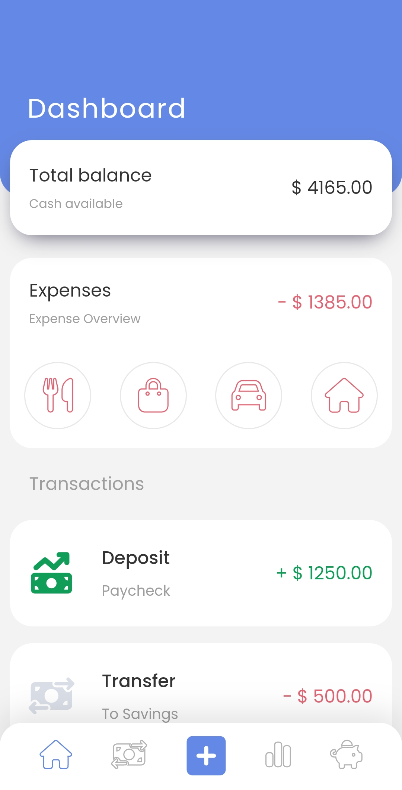
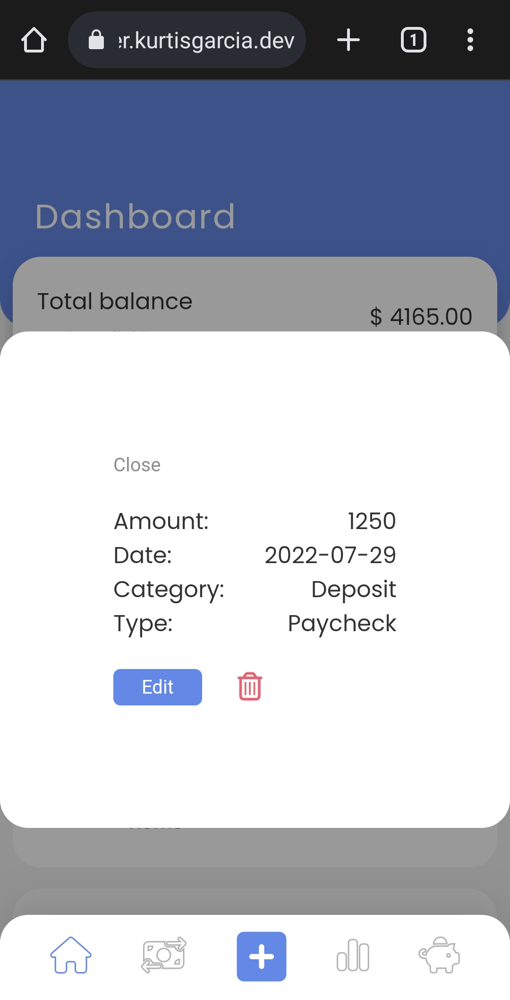
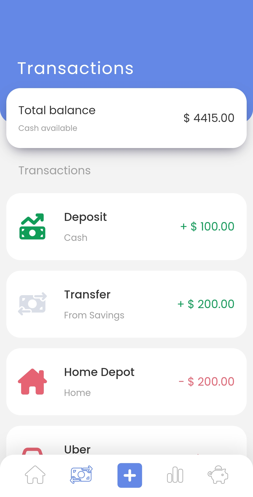
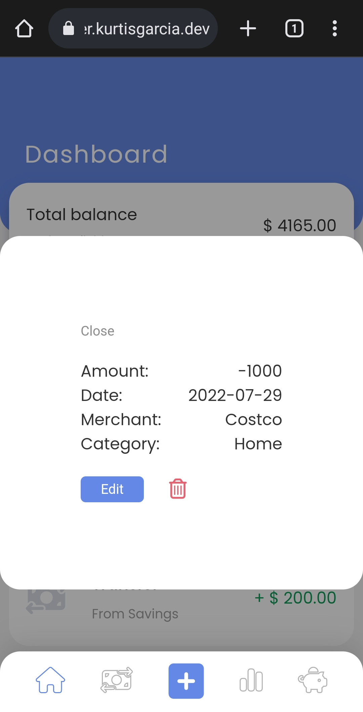
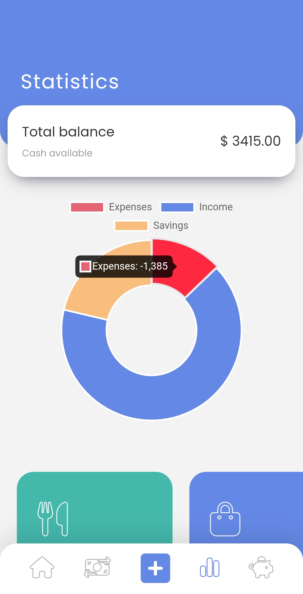
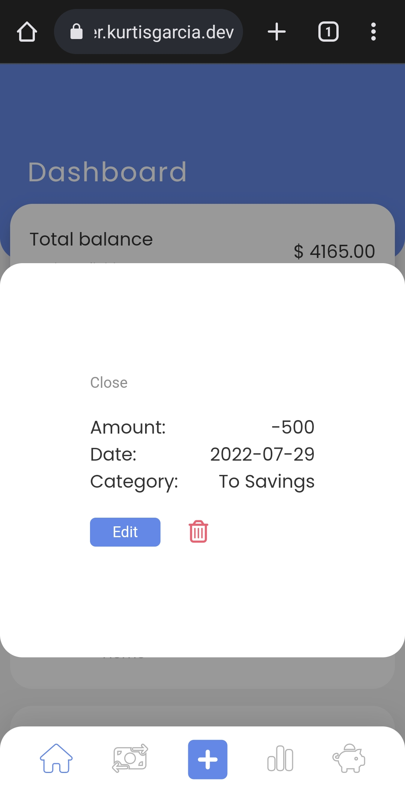
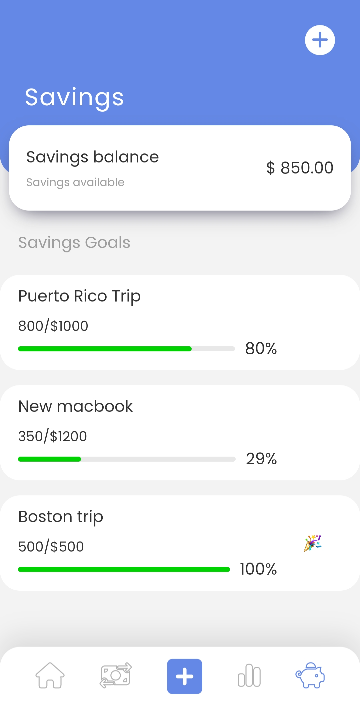

# Finance Tracker
##### *[Click Here](https://financetracker.kurtisgarcia.dev) for live site*

The purpose of this project is to allow users to keep track of their finances and create savings goals!

### How To Use

- ##### *Bottom Navbar:*
    - Click "home" button to go to dashboard page.
    - Click "transaction" button to go to transactions page.
    - Click "add" button on navbar to add a transaction(expense, deposit, and transer).
    - Click "chart" button to go to statistics page.
    - Click "piggy bank" button to go to savings page.

- ##### *Dashboard page:*
    - Get an overview of your finances.
    - View your total balance.
    - Get a visual of the percentage of money spent on each expense category.
    - View the 10 most recent transactions.
    - Click on each transaction to view/edit details or delete transaction.

- ##### *Transactions page:*
    - View your total balance.
    - View all transactions.
    - Click on each transaction to view/edit details or delete transaction.

- ##### *Statistics page:*

    - View your total balance.
    - Get a "pie chart" visual comparison of expenses, income, and savings. 
    - View amount of money spent on each category and amount of money in savings.

- ##### *Savings page:*

    - View your savings balance.
    - Click "add" button at top right of screen to add a savings goal and goal amount.
    - Click on goal to view goal details, contribute towards goal, or delete goal.
    - Visualization of goal progress will be shown. Once goal is reached, a celebration emoji will animate in.

### Motivation
The motivation for this project came from wanting to challenge myself to build a project working with numbers. What better way to work with numbers than to build a web application that allows a user to track their finances?

### Challenges and Solutions
I encountered lots of challenges while working on this project. One of the bigger challenges I faced was getting the Savings Page progress bar feature to animate every time the user clicked on the Savings Page. I partly solved this issue by adding a CSS transition. This alone did not solve the issue. After slamming my head on the keyboard a couple of times (not really!), and lots of google searches, I realized I needed a setTimeout(). This problem was solved by adding a setTimeout() to the Savings Button click event listener. After the setTimeout() the progress bar element would be styled to match the percentage of the progress in addition to triggering the transition effect, therefore giving a beautiful animation of the progress each time the user goes to the Savings Page. 

### Screenshots

### Features
- Users can add, edit, delete, and view transactions such as deposits, expenses, and trasfer to and from the savings section.
- Users can also create savings goals with a target amount to contribute towards.

**Technologies Used:**
- [Javascript](https://developer.mozilla.org/en-US/docs/Web/JavaScript)
- [HTML](https://developer.mozilla.org/en-US/docs/Web/HTML)
- [CSS](https://developer.mozilla.org/en-US/docs/Web/CSS)
- [Chart.js](https://www.chartjs.org/)
- [Progressbar.js](https://kimmobrunfeldt.github.io/progressbar.js/)